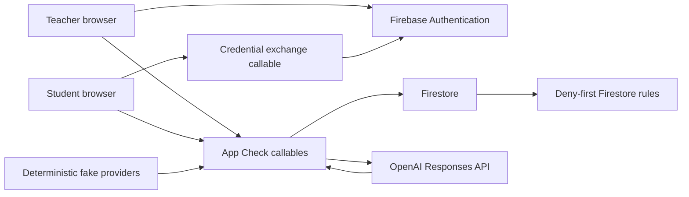

# Architecture

## Context

Quiz Master is a React/Firebase application with two trust levels: a teacher controls classroom data and approvals; a student receives a narrowly scoped identity for one classroom and student record. Firestore is authoritative. Browser storage is only a resilience cache for the active answer.

The design optimizes for a safe Build Week vertical slice, not for district-scale deployment.

## System view



OpenAI is server-only. The emulator forces deterministic fake providers. Browser read-aloud uses `speechSynthesis` and remains optional.

## Trust boundaries

### Teacher identity

Teachers use Firebase Google sign-in in production. The bootstrap callable grants the `teacher` claim and creates the canonical teacher record. Anonymous teacher bootstrap is accepted only in the emulator.

Teacher callables verify:

- authenticated `role=teacher`;
- App Check outside the emulator;
- active teacher record;
- classroom ownership and active state;
- strict runtime input schemas.

### Student identity

The client submits class code, student handle, and PIN to an App Check-protected callable. The server applies throttling, compares an `scrypt` hash using a per-student salt and server pepper, and returns a Firebase custom token containing `role`, `classroomId`, `studentId`, and `authVersion`.

Every student session callable re-reads the current classroom and student record. Archiving a class, disabling a student, or incrementing `authVersion` invalidates access.

Raw class codes and PINs are display-once values. They are not stored in the client after exchange.

## Data layout

```text
teachers/{teacherId}
classrooms/{classroomId}
  students/{studentId}                 safe identity; hashes are isolated server fields
  studentProfiles/{studentId}          teacher-only structured observations
  recommendations/{proposalId}         append-only AI proposal
  assignments/{assignmentId}
    questions/{questionId}             student-visible published content
    revisions/{revisionId}             safe revision metadata
    answerKeys/{revisionId}             server-only
  assignmentTargets/{assignmentId.studentId}
  sessionTargets/{targetId}             server-only one-session pointer
  sessions/{sessionId}
    attemptEvents/{eventId}
    supportEvents/{eventId}
    idempotency/{requestHash}            server-only
    questionProgress/{questionId}        server-only
  audits/{auditId}
    decisions/final_decision             immutable teacher decision
  demoEvidenceSeeds/{seedId}             emulator-only seed manifest
supportPlans/{studentId}
  versions/{planId}                      server-only immutable history
```

Firestore rules allow only the owning teacher or scoped student to read the minimum required records. Canonical identity, assignment, plan, session, event, recommendation, and audit writes go through callables. Answer keys and support-plan versions are never directly readable by clients.

## Core flows

### Onboarding and plans

1. The teacher answers nine optional structured questions.
2. The server stores structured observations, not a chat transcript.
3. A fake or OpenAI provider returns catalog-constrained proposed supports.
4. The server rejects invented evidence, diagnoses, invalid settings, unsafe timer behavior, malformed output, refusal, and timeout.
5. The teacher edits and approves supports.
6. A callable creates an immutable plan version and atomically moves the active pointer.
7. Revert creates a new version; history is never rewritten.

### Assignment publication

1. The teacher creates a strict draft containing public question material and protected keys.
2. The server generates IDs and writes assignment metadata, questions, revision, and answer key atomically.
3. Publication is a one-way draft-to-published transition.
4. Targeting snapshots the student’s active plan ID/version.

Public questions and answer keys are physically separate. The client never receives the protected key.

### Student work

1. The student lists only targets carrying their student ID.
2. `startOrResumeStudentSession` verifies target, published revision, and pinned plan, then returns student-safe plan settings.
3. Attempts are graded server-side using deterministic code and recorded with server IDs/timestamps.
4. Idempotency keys make exact retries stable and reject changed reuse.
5. A student may advance after at least one recorded attempt, regardless of correctness.
6. Support events accept only enabled supports from the pinned plan.
7. The active typed answer and retry key are cached locally and cleared on advance, completion, or sign-out.

### Evidence audit

1. The server loads at most 50 sessions, 50 attempts, and 50 support events.
2. Deterministic code calculates canonical metrics and applies the default 2-session/10-response threshold.
3. AI receives bounded metrics and exact event facts; it cannot calculate canonical values.
4. Post-validation requires exact event IDs/text, at most two suggestions, valid action/support state, and conservative language.
5. The audit is append-only and cannot change a plan.
6. A separate teacher decision callable rejects stale plans and duplicate decisions; an approved change creates a new plan version with source `audit`.

## Shared contracts

`packages/domain` is the contract source for both client and Functions. It provides branded IDs, strict Zod schemas, fixtures, support catalog settings, assignment materialization, answer checking, plan transitions, evidence metrics, and AI safety checks.

The root typecheck intentionally compiles consumers against these source contracts; the Functions workspace also checks against the built package.

## Failure behavior

- OpenAI failure produces manual setup/review, never a blocked student flow.
- Network failure preserves the current typed answer and exact retry key locally.
- Incorrect answers do not create an infinite gate.
- Countdown timers are off or non-expiring and cannot submit work.
- Stale ownership, auth versions, plan pointers, revisions, or audit sources fail closed.
- Logs use stable error codes and avoid student observations, submitted answers, PINs, and provider error bodies.

## Deployment posture

Production requires Firebase Auth, Firestore, Functions, Hosting, App Check with reCAPTCHA Enterprise, server secrets, indexes, and a reviewed `AI_PROVIDER` setting. The current app has not completed its real-school privacy/security readiness gate. Use the emulator and synthetic data for development and demonstrations.

Architecture decisions are recorded in [docs/adr](./docs/adr/README.md).
